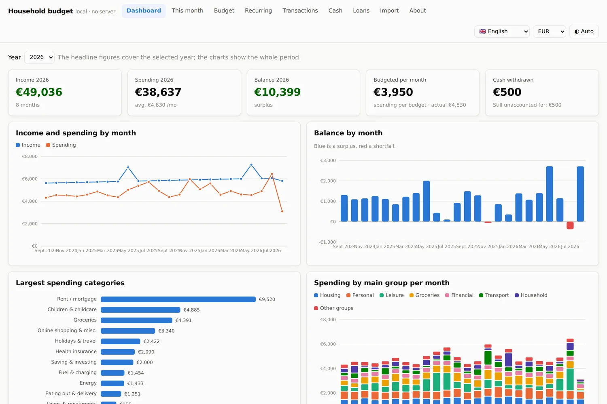

# Huishoudboekje

Een huishoudboekje dat volledig op je eigen computer draait. Je opent één html-bestand in je browser,
sleept je bankafschriften erin, en ziet meteen waar je geld heen gaat.

**Zes talen**, om te wisselen met de vlaggen rechtsboven: Nederlands, English, Français, Deutsch,
Español en 中文. De interface, de standaardcategorieën, de maandnamen en de getalnotatie schakelen mee;
de valuta kies je er los bij.

**Er is geen server, geen account en geen internetverbinding.** Je bankgegevens verlaten je computer niet.
De pdf- en Excel-lezers zitten in het bestand zelf, dus de app legt geen enkele verbinding naar buiten.
Dat kun je zelf controleren met het netwerktabblad van je browser.



*De schermafbeeldingen tonen de meegeleverde voorbeelddata, geen echte gegevens.*

## Snel beginnen

Er zijn twee manieren, met hetzelfde bestand erachter.

**In je browser:** ga naar [myofflinebudget.app](https://myofflinebudget.app) en klik op
openen. Niets te installeren; na de eerste keer werkt hij ook zonder internet en kun je hem
als app naast je andere programma's zetten.

**Als bestand:** download `index.html` (of het hele project als zip) en dubbelklik het. Het
opent in je browser en blijft van jou, ook als de website ooit verdwijnt.

**Op de Mac:** in de repo staat ook `My Offline Budget.app` — dubbelklikken en hij opent in je
browser, met een eigen icoon in Finder, Dock en Launchpad. Geen installatie, gewoon hetzelfde
`index.html` in een klein jasje. (Onherkend als developer bij de eerste keer openen? Rechtsklik
op de app en kies **Open**.)

Daarna in beide gevallen: ga naar **Import** en sleep je afschriften erin.

Let op dat je browser gegevens per plek bewaart. De versie in je browser en het gedownloade
bestand houden dus elk hun eigen boekhouding bij; stap je over, exporteer dan eerst je
back-up bij Import en lees hem aan de andere kant weer in.

Meer is het niet. Geen installatie, geen `npm install`, geen build.

Wil je eerst rondkijken? Klik op **Import → Voorbeelddata laden**. Dan vult de app zich met een
verzonnen huishouden van twee jaar: twee salarissen, hypotheek, energie, kinderopvang, boodschappen,
abonnementen en twee vakanties. Wissen kan met één knop.

## Wat kan het lezen?

| Formaat | Bron |
|---|---|
| pdf | ING, Knab, Rabobank, ICS/Visa (ANWB, ABN) — herkend aan de opmaak |
| csv | ING-export; andere banken via automatische kolomherkenning |
| xlsx / xls | American Express transactieoverzicht, en elke tabel met een datum-, omschrijving- en bedragkolom |
| plakken | regels uit je bankomgeving of een spreadsheet, gescheiden door tab, puntkomma of komma |

Regels die je al hebt worden herkend en overgeslagen, dus je kunt hetzelfde afschrift gerust twee keer
inlezen. Bedragen worden overgenomen zoals ze op het afschrift staan.

Staat jouw bank er niet bij? De csv-export van vrijwel elke bank werkt via de generieke herkenning.
Lukt het niet, open dan een issue met een voorbeeldregel (zonder je echte gegevens) — of voeg zelf een
parser toe in `src/parsers.js`; ze zijn kort en los van elkaar te lezen.

## Wat kun je ermee?

- **Dashboard** — inkomsten tegenover uitgaven per maand, saldo, grootste uitgavenposten, uitgaven per hoofdgroep.
- **Deze maand** — de vraag waar het om draait: wat is er nog te besteden. Verwacht inkomen (de mediaan
  van de laatste twaalf maanden, zelf aan te passen) min je vaste lasten is je vrije ruimte; daarnaast
  zie je per categorie wat er nog in het potje zit en waar je er al overheen bent.
- **Budget** — een bedrag per maand per categorie, met de werkelijke uitgaven per maand ernaast en een
  kolom die laat zien wat je de afgelopen twaalf maanden gemiddeld uitgaf. Eén knop vult de begroting
  met dat historische gemiddelde.
- **Transacties** — zoeken, filteren en categorieën aanpassen. Corrigeer je er één, dan biedt de app aan
  er een regel van te maken die meteen op alle vergelijkbare boekingen slaat — ook op wat je later importeert.
- **Kas** — contante uitgaven en inkomsten die niet op een afschrift staan.
- **Vaste lasten** — herkent zelf welke bedragen met een vast ritme terugkomen: wat je per maand en per
  jaar kwijt bent aan abonnementen, wanneer de volgende afschrijving komt, welke prijs is gestegen en
  welk abonnement is gestopt.
- **Leningen** — leningen die je zelf invult: annuïtair of aflossingsvrij, met maandtermijn,
  betaalde rente tot nu toe en wat er nog openstaat.
- **Prognose, potjes, analyse en belasting** — zie hieronder; ze zitten er allemaal bij.
- **Taal en valuta** — zes talen en zes valuta's, direct te wisselen; je keuze wordt onthouden.

### Vast, vrij of opname

Niet elke categorie hoort in een budget. Elke categorie heeft daarom een soort:

- **Vast** — hoort in het budget: huur, energie, water, verzekeringen, boodschappen, abonnementen,
  wegenbelasting. Je zet er een bedrag per maand op en de app houdt bij wat er nog in zit.
- **Vrij** — betaal je uit wat er na de vaste lasten overblijft: een keer uit eten, een cadeau, een
  huurauto, een aflossing die je doet als het kan. Geen budget nodig; het gaat van de vrije ruimte af,
  en is die er niet, dan zie je dat meteen.
- **Opname** — geld van de rekening halen is geen uitgave maar een verplaatsing. Contante opnames
  tellen daarom niet mee als uitgave. Wat je contant betaalde boek je op het tabblad **Kas**; dat wordt
  van de opname afgetrokken, zodat je ziet welk deel nog niet verantwoord is.

De app kiest zelf een eerste indeling: noodzakelijke posten en alles wat met een vast ritme terugkomt
worden vast, de rest vrij, en iets dat op een geldopname lijkt wordt opname. Je verandert het per
categorie met één klik op het tabblad Budget.

Categorieën worden automatisch toegekend op basis van tekstregels (zie `src/rules.json`: ruim veertig
categorieën met patronen voor supermarkten, energie- en waterbedrijven, verzekeraars, telecom,
tankstations, streamingdiensten en meer, in Nederland, België, Duitsland, Frankrijk, Spanje, het
Verenigd Koninkrijk en de Verenigde Staten). Wat er niet uitkomt
belandt in "Nog te categoriseren" — die zet je zelf goed en dat onthoudt de app.

Op het tabblad Import staat ook een **volledigheidscontrole**: per rekening welke periode is ingelezen,
of er lege maanden middenin zitten en of een rekening achterloopt op de rest. Zo zie je meteen wanneer
er een afschrift ontbreekt.

### Hoe de herkenning van vaste lasten werkt

Boekingen worden gegroepeerd per partij (de naam zonder ibans, referenties en ruis), per dag opgeteld,
en dan getoetst op twee dingen: komt de tussenpoos regelmatig terug (wekelijks tot jaarlijks, met de
mediaan als maat), en staat het bedrag min of meer vast. Die tweede eis is wat boodschappen buiten de
lijst houdt: bij Albert Heijn is de frequentie regelmatig, maar het bedrag niet.

## Uitgebreid: prognose, potjes, analyse en belasting

Deze vier onderdelen zaten tot september 2026 in een aparte, betaalde uitgave. Ze zitten
er nu gewoon bij: geen licentiecode, geen tweede repository, alles onder dezelfde
MIT-licentie.

- **Prognose** — je saldo per dag voor de komende drie tot twaalf maanden, met het laagste
  punt en de dagen waarop je onder een zelfgekozen grens komt.
- **Potjes** — wat je per maand opzij moet leggen voor kosten die maar een paar keer per
  jaar komen, met voorstellen uit je eigen afschriften.
- **Analyse en doorlichting** — twee even lange periodes per categorie met de inflatie
  ernaast, het seizoenspatroon, opvallende boekingen, en een doorlichting van je vaste
  lasten: prijsstijgingen, dubbel lopende posten en wat er is gestopt.
- **Belasting** — een schatting van de inkomstenbelasting voor Nederland en Duitsland:
  krijg je iets terug of moet je bijbetalen, en wat is je marginale druk.

De bron staat in `src/pro.js` en `src/fiscaal.js`. Wat erbij komt kijken om de tabellen
te onderhouden — een nieuw belastingjaar, een land toevoegen, een tabellenbestand
ondertekenen — staat in [ONDERHOUD.md](ONDERHOUD.md).

## Bijwerken

Op het tabblad **Belasting** staat een knop om de belastingtabellen bij te werken. Die
doet niets uit zichzelf: pas als jij erop drukt haalt hij één klein ondertekend bestand op
met de nieuwe tarieven. Er gaat niets van jou mee — geen boeking, geen bedrag, geen
identificatie. De handtekening wordt gecontroleerd met de publieke sleutel die in de app
zit, zodat er onderweg niet met het bestand geknoeid kan worden.

Het adres staat in een apart veld dat door een update nooit wordt overschreven. Houd je
een eigen kopie bij, wijs hem daarheen; maak je het veld leeg, dan staat bijwerken uit.

Eén ding om te weten: als je de app opent door op het bestand te dubbelklikken, is de
oorsprong van de pagina `file://`, en niet elke browser laat zo'n pagina naar buiten.
Chrome en Firefox doen het meestal wel, Safari is er streng in. Lukt het niet, dan zegt
de app dat en zet hij de twee knoppen klaar die het altijd doen: het adres openen in je
browser, het bestandje bewaren en het hier inlezen. Dezelfde handtekeningcontrole,
hetzelfde resultaat, één klik extra. Serveer je de map met een lokale webserver, dan
werkt de knop wel gewoon in één keer.

## Waar staat mijn data?

In de `localStorage` van je browser, gekoppeld aan dit bestand. Dat betekent:

- Verhuis je het bestand naar een andere map, dan blijft je data staan.
- Wis je je browsergegevens, dan is het weg.
- Een andere computer of browser ziet je gegevens niet.

Maak daarom af en toe een back-up: **Import → Exporteer back-up (json)**. Datzelfde bestand lees je op
een andere computer weer in, of deel je met je partner.

## Zelf bouwen

Het bestand `index.html` is samengesteld uit de losse bronnen in `src/`:

```
src/styles.css       opmaak en kleuren (licht en donker)
src/parsers.js       de importlezers per bank
src/app.js           de app zelf: berekeningen, grafieken, opslag
src/pro.js           prognose, potjes, analyse, doorlichting en belasting
src/fiscaal.js       de fiscale tabellen per land en per jaar
src/licentie.js      handtekeningcontrole bij het bijwerken van de tabellen
src/rules.json       categorieregels
src/demo.json        de voorbeelddata
src/i18n.js          vertalingen: interface, groepen en categorieën
src/index.tpl.html   het sjabloon
tools/sign.py        tabellenbestanden ondertekenen (zie ONDERHOUD.md)
tools/public.b64     de publieke sleutel die bij het bouwen wordt ingezet
tools/versie.json    uitgavedatum, naam en release-tekst per taal
```

Opnieuw samenstellen:

```bash
python3 build.py
```

Meer is er niet nodig. Ontbreekt de map `vendor/`, dan haalt het script pdf.js en SheetJS
één keer op van cdnjs en bakt ze in het html-bestand; daarna heeft de app nooit meer
internet nodig. Met `--pwa` krijg je de variant voor op een webserver (manifest en service
worker), met `--uit MAP` schrijf je hem ergens anders heen.

## Vertalingen

Alle teksten staan in `src/i18n.js`, met per taal dezelfde sleutels. Een taal toevoegen is dat bestand
kopiëren, vertalen, en de code toevoegen aan `order` onderaan. Categorieën die je zelf aanmaakt of die
uit je eigen import komen worden niet vertaald — die blijven staan zoals jij ze schreef.

## Grafieken

De kleuren komen uit een palet dat is getoetst op kleurenblindheid en op contrast met de achtergrond,
in zowel licht als donker. Elke grafiek heeft een legenda of directe labels, en de cijfers staan
daarnaast ook als tabel — kleur draagt nooit in z'n eentje de betekenis.

## Hoe goed deelt hij in?

Op de meegeleverde voorbeelddata van 1.228 boekingen komt de automatische indeling op **99,9%** uit.
Dat is een gunstig getal, want die data is gemaakt met herkenbare winkelnamen. Op echte afschriften
met overboekingen aan particulieren ligt het lager; reken op een deel dat je zelf indeelt. Elke
correctie kun je met één klik in een regel omzetten, dus dat werk doe je één keer.

## Beperkingen, eerlijk gezegd

- Pdf-afschriften worden gelezen op basis van hun opmaak. Verandert een bank die opmaak, dan kan de
  lezer struikelen. Controleer het voorbeeld dat de app toont voordat je regels toevoegt.
- Automatische categorisering is een hulpmiddel, geen waarheid. Reken erop dat je een deel zelf indeelt.
- Meerdere valuta's worden niet omgerekend; bedragen komen binnen zoals ze op het afschrift staan.
- Dit is geen boekhoudpakket en geen financieel of fiscaal advies.

## Licentie

MIT — zie [LICENSE](LICENSE). Gebruik het, pas het aan, deel het.
